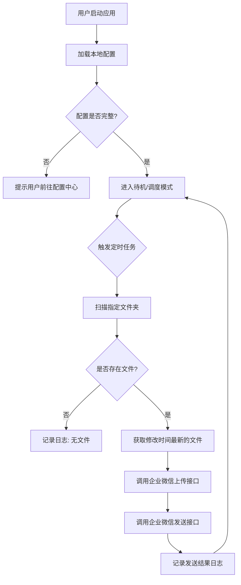

# 产品需求文档：企业微信本地文件自动发送助手

## 1. 产品概述
本项目旨在开发一款运行在用户本地电脑（macOS）上的自动化工具，能够定时扫描指定的本地文件夹，识别最新的文件，并通过企业微信（WeChat Work）API自动发送给指定的用户或群组。
该产品旨在解决用户需要定期手动汇报本地数据文件（如日报、数据报表）的繁琐重复工作，提高工作效率，确保信息发送的及时性。

## 2. 核心功能

### 2.1 用户角色
| 角色 | 注册方式 | 核心权限 |
|------|----------|----------|
| 本地用户 | 无需注册，本地运行 | 拥有所有配置、运行、查看日志的权限 |

### 2.2 功能模块
本工具主要包含以下核心页面/模块：
1. **仪表盘（Dashboard）**：显示运行状态、下一次执行时间、最近一次发送记录。
2. **配置中心（Settings）**：设置监控文件夹、企业微信API凭证、接收人/群、定时策略。
3. **日志记录（Logs）**：查看详细的执行历史和错误信息。

### 2.3 页面详情
| 页面名称 | 模块名称 | 功能描述 |
|---------|----------|----------|
| **仪表盘** | 状态概览 | 显示服务是否正在运行，显示当前时间及下一次计划任务的执行时间。 |
| | 最近记录 | 展示最近一次文件发送的结果（成功/失败、文件名、发送时间）。 |
| | 快捷操作 | 提供"立即执行一次"和"暂停/恢复任务"的按钮。 |
| **配置中心** | 基础设置 | 选择本地电脑上的目标文件夹路径。 |
| | 凭证设置 | 输入企业微信的 CorpID, Secret, AgentID (应用模式) 或 Webhook 地址 (群机器人模式)。 |
| | 接收设置 | 指定接收消息的用户ID（UserID）或部门ID（PartyID）。 |
| | 调度设置 | 设置定时任务规则（例如：每天 09:00，或每隔 X 小时）。 |
| **日志记录** | 日志列表 | 按时间倒序展示操作日志，支持查看错误详情以便排查问题。 |

## 3. 核心流程

### 3.1 业务流程
用户的主要操作流程如下：
1. 打开应用，进入配置中心。
2. 设置需要监控的本地文件夹。
3. 配置企业微信的应用参数（API Key等）。
4. 设置发送频率（如每天上午10点）。
5. 启动服务，软件在后台运行，自动执行任务。

### 3.2 流程图

## 4. 用户界面设计

### 4.1 设计风格
- **整体风格**：简洁、高效的工具类软件风格，类似 macOS 系统自带工具或简洁的开发者工具。
- **配色**：
    - 主色：企业微信蓝 (#4776E6)
    - 背景：清爽的灰白色或深色模式适配。
- **布局**：侧边栏导航或顶部Tab导航，内容区域卡片式布局。
- **字体**：系统默认无衬线字体 (San Francisco)。

### 4.2 页面设计概览
| 页面名称 | 模块名称 | UI 元素 |
|---------|----------|---------|
| 仪表盘 | 概览卡片 | 大号字体显示"运行中"状态，绿色指示灯。显示"最近发送：report.xlsx (今天 09:00)"。 |
| 配置中心 | 表单区域 | 文件夹选择器组件，输入框（带掩码显示Secret），下拉菜单选择时间频率。底部有"保存"按钮。 |

### 4.3 响应式
- **桌面端优先**：专为 macOS 桌面环境设计，窗口大小可调整，但主要针对桌面操作优化。
