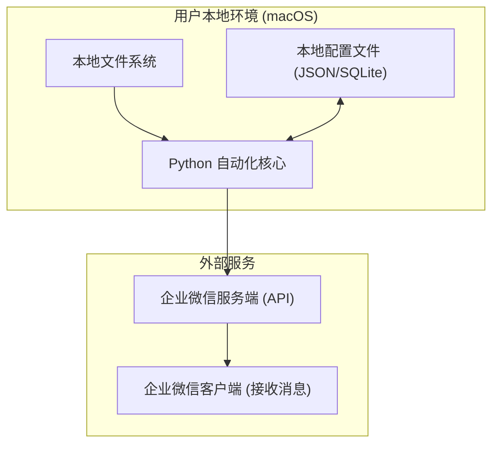
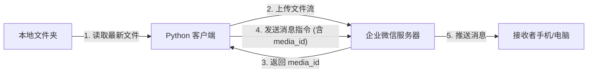

# 技术架构文档：企业微信本地文件自动发送助手

## 1. 架构设计

本系统采用轻量级本地客户端架构，核心逻辑由 Python 脚本驱动，直接与文件系统和企业微信 API 进行交互。



### 方案对比
为了满足"电脑登录企业微信，发送文件"的需求，存在两种主要技术路径：

*   **方案 A：官方 API (推荐)**
    *   **原理**：使用企业微信官方提供的开发者 API (自建应用)。
    *   **优点**：稳定、可靠、无需模拟人工操作、支持后台静默运行。
    *   **缺点**：需要企业微信管理员权限来创建应用并获取 Secret。
    *   **结论**：本项目**首选此方案**，因为其稳定性远高于 RPA。

*   **方案 B：本地 RPA / 模拟操作**
    *   **原理**：使用 GUI 自动化工具 (如 PyAutoGUI) 模拟鼠标点击，控制 PC 版企业微信发送文件。
    *   **优点**：不需要 API 权限，所见即所得。
    *   **缺点**：极不稳定（窗口位置变动、弹窗干扰都会导致失败）、独占鼠标/屏幕、难以后台运行。
    *   **结论**：作为备选方案，仅在无法获取 API 权限时考虑，本文档不详细展开。

## 2. 技术栈说明

*   **编程语言**：Python 3.10+
    *   选择理由：Python 拥有丰富的生态系统，特别是在文件处理、网络请求和任务调度方面。
*   **核心依赖库**：
    *   `requests`: 用于处理 HTTP 请求，与企业微信 API 交互。
    *   `schedule`: 用于轻量级的定时任务调度。
    *   `watchdog` (可选): 如果需要实时监听文件变动而非定时扫描。
    *   `tkinter` 或 `PyQt` (可选): 如果需要图形化配置界面。对于 MVP 版本，可先使用 `config.json` 配置文件。
*   **数据存储**：
    *   本地 `config.json`: 存储配置信息（API Key, 路径, 定时规则）。
    *   本地 `app.log`: 存储运行日志。

## 3. 核心模块与逻辑

### 3.1 核心类设计
*   `ConfigManager`: 读取和保存配置。
*   `FileScanner`: 负责扫描指定目录，按修改时间排序，返回最新的文件路径。
*   `WeComClient`: 封装企业微信 API 调用（获取 Token, 上传媒体, 发送消息）。
*   `Scheduler`: 管理定时任务的生命周期。

### 3.2 目录扫描逻辑
```python
# 伪代码示例
import os
import glob

def get_latest_file(directory_path, file_pattern="*"):
    files = glob.glob(os.path.join(directory_path, file_pattern))
    if not files:
        return None
    # 按修改时间降序排列
    latest_file = max(files, key=os.path.getmtime)
    return latest_file
```

## 4. API 定义 (外部接口)

本项目作为客户端，主要调用企业微信官方 API。

### 4.1 获取 Access Token
*   **URL**: `GET https://qyapi.weixin.qq.com/cgi-bin/gettoken`
*   **参数**: `corpid`, `corpsecret`
*   **用途**: 获取后续接口调用的凭证。

### 4.2 上传临时素材
*   **URL**: `POST https://qyapi.weixin.qq.com/cgi-bin/media/upload`
*   **参数**: `access_token`, `type=file`
*   **Body**: `multipart/form-data` (文件内容)
*   **用途**: 发送文件前需先上传至微信服务器，获取 `media_id`。

### 4.3 发送应用消息
*   **URL**: `POST https://qyapi.weixin.qq.com/cgi-bin/message/send`
*   **参数**: `access_token`
*   **Body**:
    ```json
    {
       "touser" : "UserID1|UserID2",
       "msgtype" : "file",
       "agentid" : 1000002,
       "file" : {
            "media_id" : "MEDIA_ID"
       },
       "safe":0
    }
    ```

### 4.4 群机器人发送 (替代方案)
如果只需发送到群，且有群机器人 Webhook，可简化流程。
*   **URL**: `POST https://qyapi.weixin.qq.com/cgi-bin/webhook/send?key=KEY`
*   **Body**:
    ```json
    {
        "msgtype": "file",
        "file": {
            "media_id": "MEDIA_ID"
        }
    }
    ```
    *(注意：群机器人也需要先调用上传素材接口，但上传接口地址略有不同，需使用 `https://qyapi.weixin.qq.com/cgi-bin/webhook/upload_media?key=KEY&type=file`)*

## 5. 数据流向



## 6. 安全与隐私
*   **凭证安全**：`Secret` 和 `Key` 仅存储在用户本地电脑的配置文件中，不上传任何第三方服务器。
*   **文件隐私**：文件仅经由 HTTPS 加密通道直接上传至企业微信官方服务器，不经过任何中间跳转。
